# Macro Tracker

Track your macros, water intake, and weight effortlessly — built with Node.js, Express, MongoDB, and JWT authentication. Includes optional OpenAI-powered meal suggestions.

---

## Features

- **User Auth**: JWT + bcryptjs  
- **Daily Macros**: Set and hit targets (calories, protein, carbs, fat, water)  
- **Food Logging**: Search and log food items  
- **Water & Weight Logging**  
- **Daily Dashboard**: Aggregated macros using MongoDB aggregation  
- **AI Meal Suggestions** via Gemini API Key

---

## Tech Stack

- **Node.js** & **Express.js**  
- **MongoDB** with **Mongoose**  
- **Authentication**: `jsonwebtoken`, `bcryptjs`  
- **AI Integration**: OpenAI API 

---
### **Start the Server:**
     node server.js

## Endpoints

1. Register 
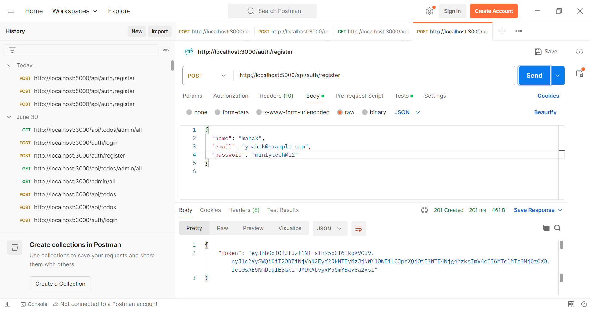

2. Login 
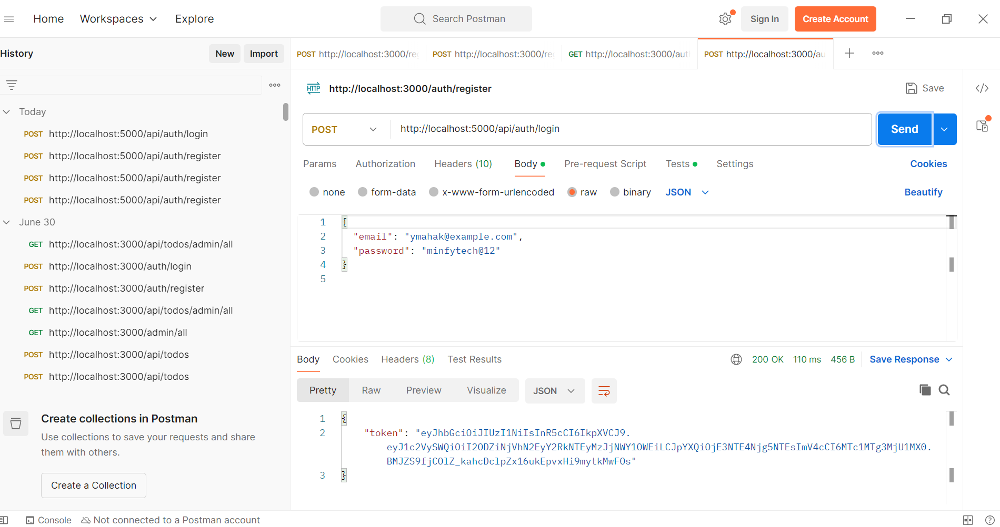

3. Profile 
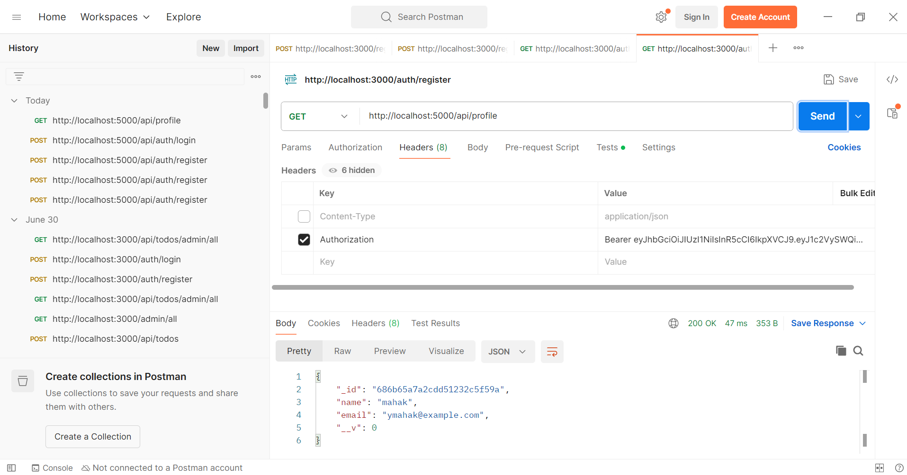

4. Macro update
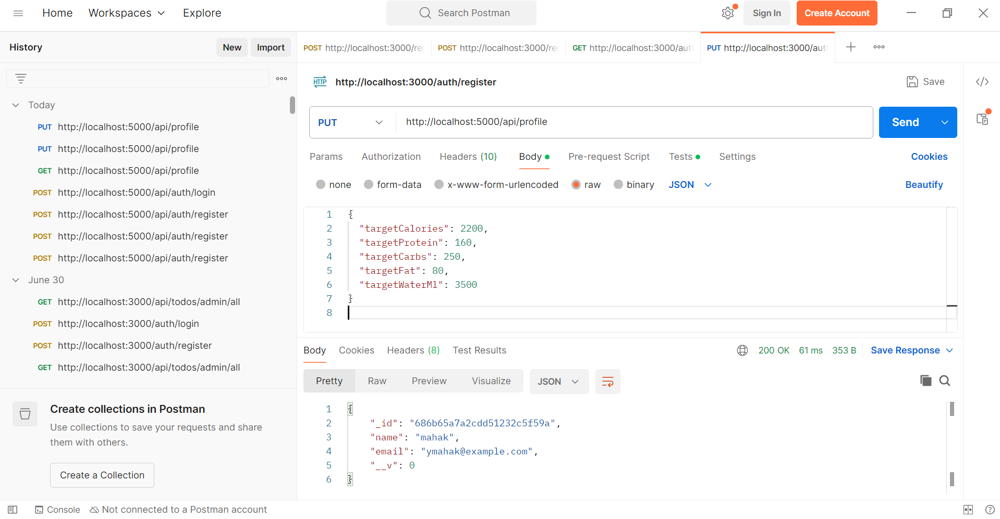

5. Search Food
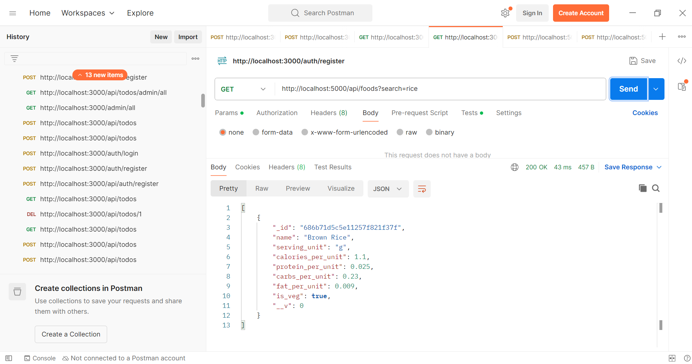

6. Add Food Entry
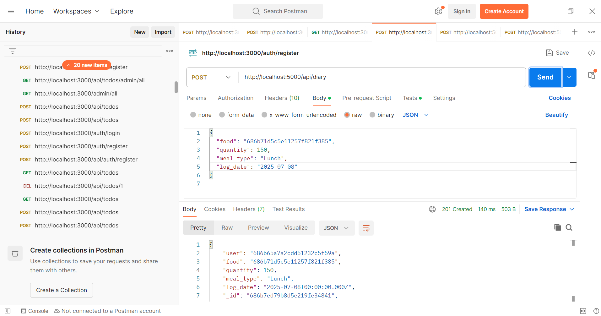

7. Get Food
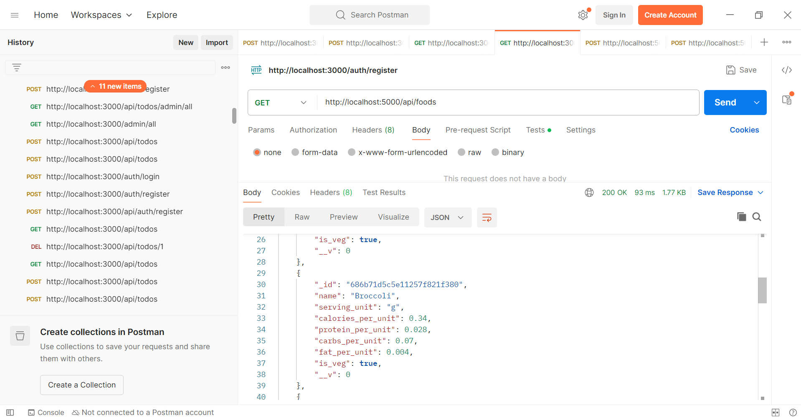

8. Log Weight
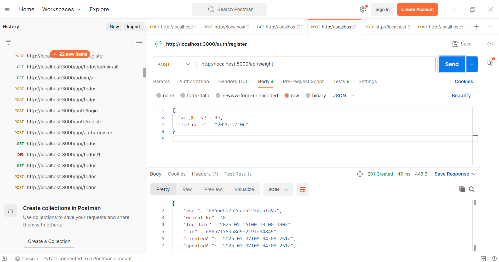

9. Log water
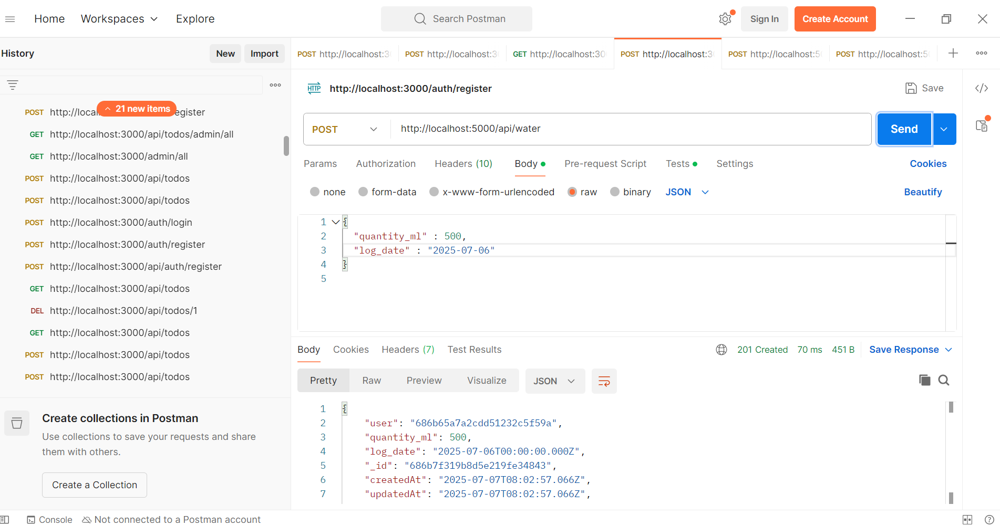

10. Dashboard
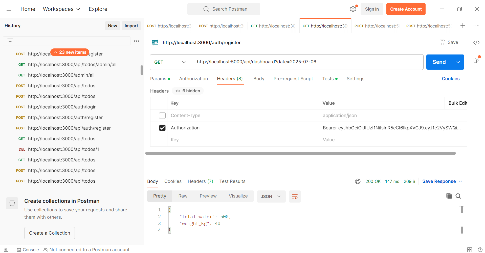

11. Suggestion from Open AI 
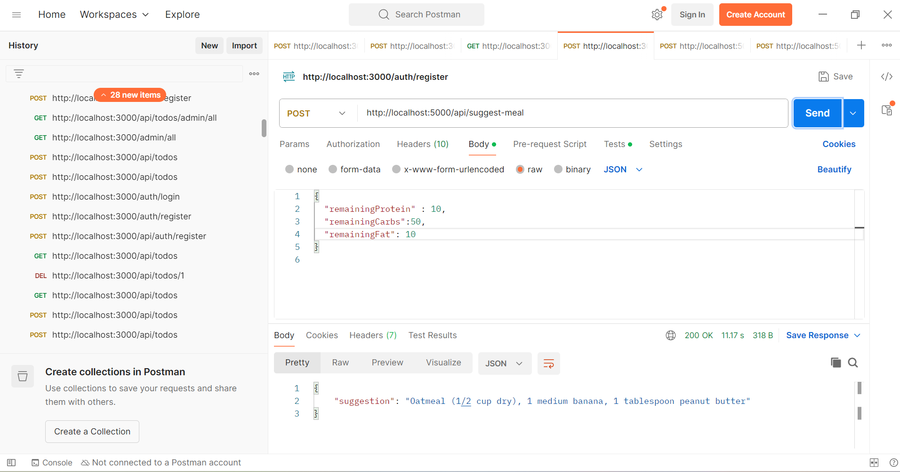

